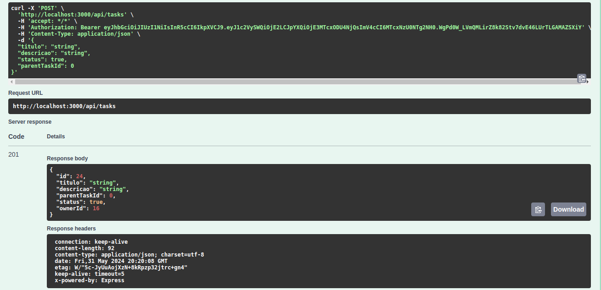
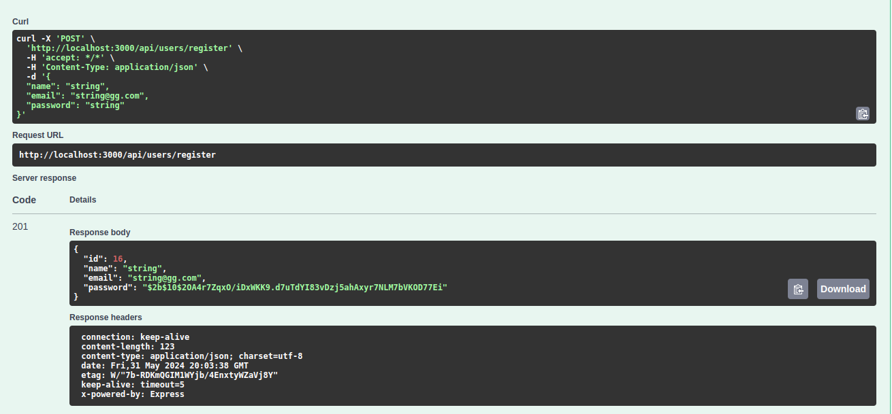
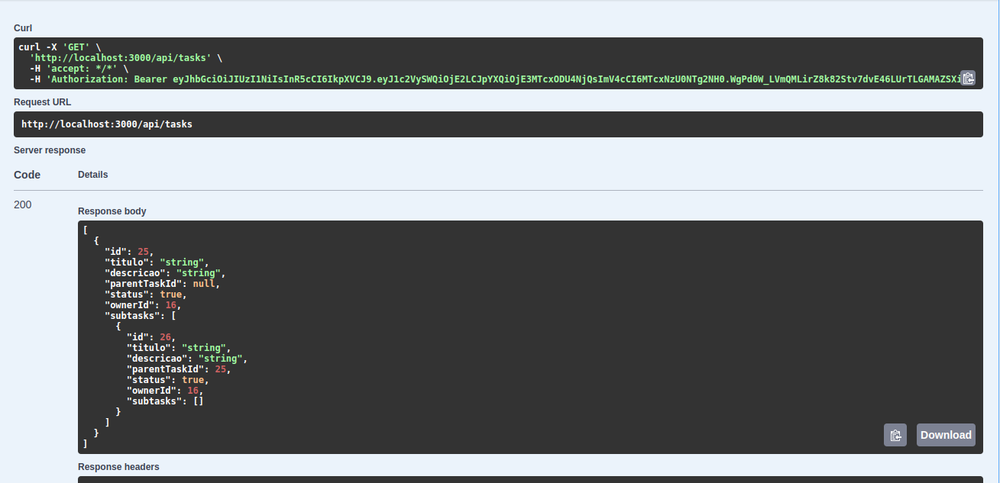

# TodoList API

Esta é uma API para gerenciar tarefas em uma lista de afazeres.

## Instalação

Certifique-se de ter o Node.js e o Docker instalados em seu sistema.

1. Clone este repositório.
2. Execute `npm install` para instalar as dependências.

## Configuração

Antes de executar a aplicação, configure as variáveis de ambiente.

Crie um arquivo `.env` na raiz do projeto com as seguintes variáveis:
Existe um arquivo de exemplo. Deverá ser feita a conexão com um banco MySQL localmente.

### Exemplo

- `PORT=3000`
- `SECRET_KEY=SuaChaveSecreta`
- `DB_HOST="localhost"`
- `DB_PORT="3306"`
- `DB_USER="seu_nome"`
- `DB_PASSWORD="123456"`
- `DB_NAME="TodoList"`
- `DB_TYPE="mysql"`

## Scripts

### Executando Migrações

`npx prisma migrate dev --name migrate`

Isso criará um novo arquivo de migração com o nome especificado na pasta prisma/migrations. Você pode adicionar e modificar os modelos no schema.prisma conforme necessário antes de aplicar a migração.

Para aplicar as migrações pendentes no banco de dados, execute:

`npx prisma migrate deploy`

Isso aplicará as migrações pendentes e atualizará o esquema do banco de dados de acordo com o schema.prisma.

### Executando a Aplicação

Para iniciar o servidor localmente:

`npm start`

## Docker (em implementação para conectar ao banco)

### Isso disponibilizará a aplicação em http://localhost:3000.

# Rotas Disponíveis

## Usuários
- POST /api/users/register -> Cria um novo usuário.
- POST /api/users/login -> Faz login do usuário.
- DELETE /api/users/{id} -> Deleta um usuário.

## Tarefas
- POST /api/tasks -> Cria uma nova tarefa com título, descrição, status e opcionalmente uma tarefa pai.
- GET /api/tasks -> Obtém todas as tarefas do usuário autenticado.
- PUT /api/tasks/{id} -> Atualiza uma tarefa com base no ID fornecido.
- DELETE /api/tasks/{id} -> Deleta uma tarefa com base no ID fornecido.
- GET /api/tasks/status -> Obtém tarefas filtradas com base no status fornecido.
- PATCH /api/tasks/{id}/toggle -> Alterna o status de uma tarefa com base no ID fornecido.

